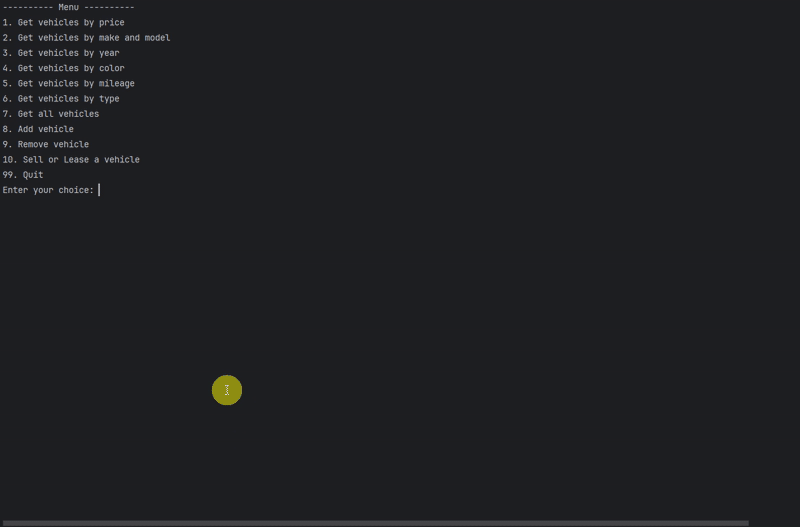
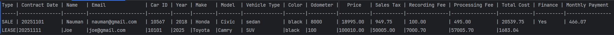

# Car Dealership Management System

## Description of the Project
This Java console application simulates a dealership management system. It builds off an older version but this version provides
the capability to store sales made at the dealership. It will update inventory and keep record of each sale. 

## User Stories

- As an employee of a dealership, I want to charge customers accurate tax and fees and give financing options so the customers can purchase vehicle. 
- As a dealership employee, I want to give customers the option to lease a vehicle so that can have lower monthly costs. 
- As an employee of a dealership, I want to gather useful customer information so that later I can store this information regardless of whether it was a sale or lease. 
- As a dealership employee, I need all sales and lease contracts to be saved to a contracts file so that we have accurate record of all sales.
 
## Setup

Instructions on how to set up and run the project using IntelliJ IDEA.

### Prerequisites

- IntelliJ IDEA: Ensure you have IntelliJ IDEA installed, which you can download from [here](https://www.jetbrains.com/idea/download/).
- Java SDK: Make sure Java SDK is installed and configured in IntelliJ.

### Running the Application in IntelliJ

Follow these steps to get your application running within IntelliJ IDEA:

1. Open IntelliJ IDEA.
2. Select "Open" and navigate to the directory where you cloned or downloaded the project.
3. After the project opens, wait for IntelliJ to index the files and set up the project.
4. Find the main class with the `public static void main(String[] args)` method.
5. Right-click on the file and select Run `CarDealership.main()` to start the application.
## Technologies Used
- Java 17 (`openjdk 17.0.12 2024-07-16`)

## Demo
### Selling A Vehicle 

### Leasing A Vehicle 

### Persistence of Contracts

## Future Work
- Use a database instead of CSV files for storage. 
- Support multiple dealerships with switching functionality.

## Thanks

- Thank you to Raymond for continuous support and guidance throughout the project.
